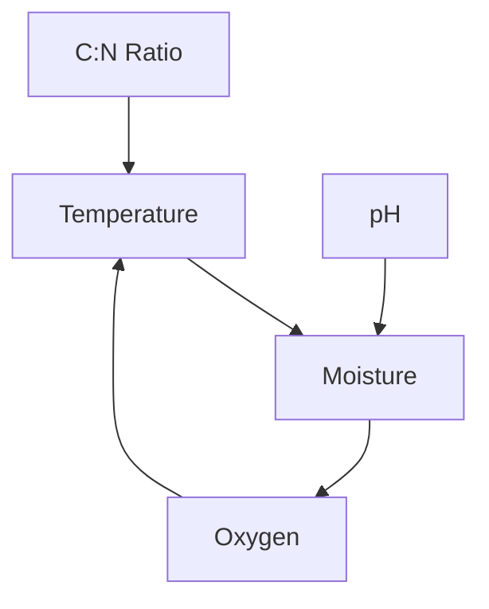

# 🌱 Smart Compost Variables & Dependencies

## 📊 Essential Variables for Composting Process

### 1. Temperature
The most critical indicator of composting activity and progress.

| Aspect | Details |
|--------|---------|
| 🌡️ Measurement Unit | Degrees Celsius (°C) |
| ✨ Optimal Range | 55-65°C for thermophilic composting |
| 📈 Frequency | Continuous/multiple times daily |
| 🔄 Dependencies | - Ambient temperature - Pile size - Microbial activity - Aeration |
| ⚡ IoT Application | Temperature sensors at various depths |

### 2. Moisture Content
Essential for microbial activity and efficient decomposition.

| Aspect | Details |
|--------|---------|
| 💧 Measurement Unit | Percentage (%) |
| ✨ Optimal Range | 40-60% |
| 📈 Frequency | Daily or continuous |
| 🔄 Dependencies | - Rainfall - Evaporation rate - Waste composition - Aeration |
| ⚡ IoT Application | Moisture sensors at different locations |

### 3. Oxygen Levels (Aeration)
Critical for aerobic decomposition and odor control.

| Aspect | Details |
|--------|---------|
| 💨 Measurement Unit | Percentage or PPM |
| ✨ Optimal Range | Above 5% oxygen content |
| 📈 Frequency | Continuous |
| 🔄 Dependencies | - Pile density - Moisture content - Particle size |
| ⚡ IoT Application | Oxygen sensors, automated aeration |

### 4. pH Level
Affects microbial activity and nutrient availability.

| Aspect | Details |
|--------|---------|
| 🧪 Measurement Unit | pH scale (0-14) |
| ✨ Optimal Range | 6.0-8.0 |
| 📈 Frequency | Daily/weekly |
| 🔄 Dependencies | - Waste composition - Microbial activity - Moisture content |
| ⚡ IoT Application | pH sensors with alerts |

### 5. Carbon-to-Nitrogen Ratio
Essential for efficient decomposition.

| Aspect | Details |
|--------|---------|
| ⚖️ Measurement Unit | Ratio |
| ✨ Optimal Range | 25:1 to 30:1 |
| 📈 Frequency | At setup and material addition |
| 🔄 Dependencies | - Waste composition - Material balance |
| ⚡ IoT Application | Material input tracking |

### 6. Particle Size
Affects decomposition rate and aeration.

| Aspect | Details |
|--------|---------|
| 📏 Measurement Unit | Centimeters/inches |
| ✨ Optimal Range | 1-5 cm (0.5-2 inches) |
| 📈 Frequency | At material addition |
| 🔄 Dependencies | - Waste type - Processing equipment |
| ⚡ IoT Application | Image processing analysis |

## 🔍 Monitoring Parameters

### 7. Odor Levels
Indicator of process health.

| Aspect | Details |
|--------|---------|
| 👃 Measurement Unit | PPM of compounds |
| ✨ Optimal Range | Minimal detectable odor |
| 📈 Frequency | Daily/continuous |
| 🔄 Dependencies | - Aeration - Moisture - C:N ratio |
| ⚡ IoT Application | Electronic nose sensors |

### 8. Microbial Activity
Core of decomposition process.

| Aspect | Details |
|--------|---------|
| 🦠 Measurement Unit | CO2 production |
| ✨ Optimal Range | Stage-dependent |
| 📈 Frequency | Continuous |
| 🔄 Dependencies | - Temperature - Moisture - Oxygen - pH |
| ⚡ IoT Application | CO2 sensors |

## 🌡️ Environmental Factors

### 9. Ambient Conditions
External influences on the process.

| Aspect | Details |
|--------|---------|
| 🌍 Measurement Unit | Various |
| ✨ Optimal Range | Climate-dependent |
| 📈 Frequency | Continuous |
| 🔄 Dependencies | - Geographic location - Season |
| ⚡ IoT Application | Weather station integration |

### 10. Pile Volume/Mass
Process scale indicator.

| Aspect | Details |
|--------|---------|
| 📦 Measurement Unit | m³ or kg |
| ✨ Optimal Range | System-dependent |
| 📈 Frequency | Weekly |
| 🔄 Dependencies | - Input rate - Decomposition speed |
| ⚡ IoT Application | Weight/volume sensors |

## 🎯 Process Control

### 11. Additives
Process optimization materials.

| Aspect | Details |
|--------|---------|
| 🧪 Measurement Unit | kg or L |
| ✨ Optimal Range | Additive-specific |
| 📈 Frequency | As needed |
| 🔄 Dependencies | - Process conditions - Material type |
| ⚡ IoT Application | Automated dosing systems |

### 12. Maturity Indicators
Final product quality measures.

| Aspect | Details |
|--------|---------|
| ✅ Measurement Unit | Various tests |
| ✨ Optimal Range | Use-dependent |
| 📈 Frequency | Weekly in final stages |
| 🔄 Dependencies | - Process duration - All parameters |
| ⚡ IoT Application | Multi-sensor analysis |

## 📊 Dependency Relationships

### Primary Control Loop

### Process Optimization
- If temperature drops: Check moisture and oxygen
- If odor increases: Verify aeration and turning
- If moisture high: Adjust aeration, monitor temperature

## 🤖 IoT Implementation Notes

1. **Sensor Placement**
   - Multiple depth points
   - Even distribution
   - Protected from elements

2. **Measurement Frequency**
   - Temperature: 15-minute intervals
   - Moisture: Hourly
   - Oxygen: Continuous
   - pH: Daily

3. **Data Integration**
   - Real-time monitoring
   - Automated alerts
   - Predictive analytics
   - Mobile app integration
